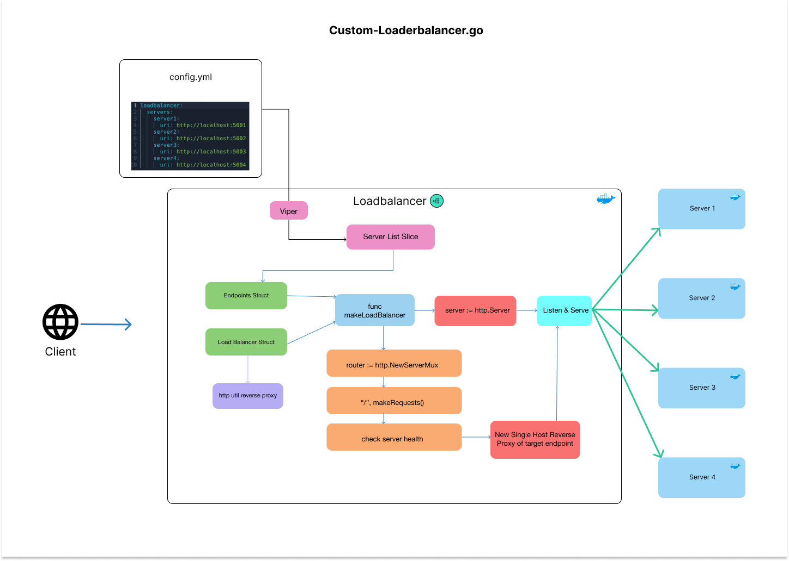

## Custom Load Balancer

## About this project

After building a microservice backend with Spring Boot's API Gateway, I was interested about the inner workings of a loadbalancer.

This project is a simple custom loadbalancer using the round-robin algorithm to cycle through 4 servers.

Similarly to Spring's API Gateway, there's a YAML file to register the endpoints that will be used.

## Run the program

- _NOTE_: This program uses ports 5001, 5002, 5003, 5004, 5005, and 9000. 9000 is the loadbalancer, and the rest are the simple servers that are cycled through.

1. Make sure to have Docker installed.
2. Make sure to have your ports 5001, 5002, 5003, 5004, 5005, and 9000 open.
3. Run `docker compose up -d`
4. Open a browser or Postman and go to `http://localhost9000`
5. Continually refresh the page to see the servers being cycled through.
6. In the terminal, run `docker logs` to see the loadbalancer prepping the endpoint, and how it handles a non-existent server
